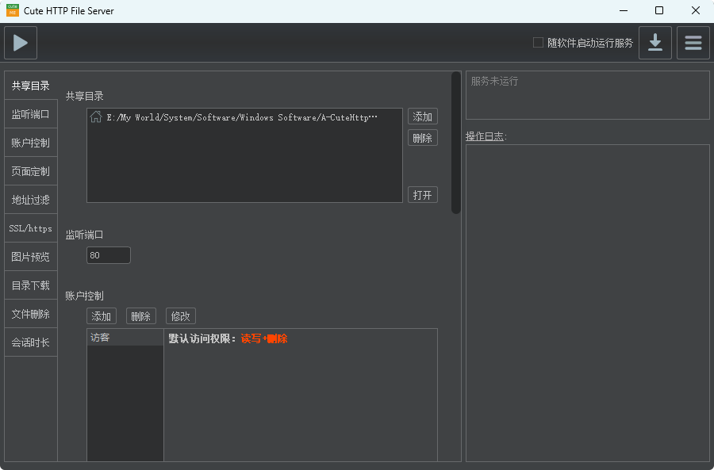

# 关于元旦晚会体艺馆场控问题及使用报告

***

> **PS**：  
> - 体艺馆场控室采用全新配备的软硬件系统  
> - 本文包含操作指南与问题解决方案  
> - ~~人工操作问题将重点标注并尝试解决~~

---

## 一、场控硬件及组织架构

### 1. 主机配置

- **职责**：使用Hirender编辑节目工程
- **稳定性保障**：禁止运行其他程序

### 2. 副机配置
- **设备要求**：任意可用电脑
- **核心职责**：
  - 话剧类节目对稿
  - 文件传输中转

### 3. 大屏幕管理
- **启动流程**：
  1. 前往后台启动屏幕服务器
  2. 热机等待约20分钟

### 4. 应急支持
- **备用设备**：至少1台备用电脑
- **人员配置**：
  - 故障处理专员
  - 视频剪辑师
  - 现场对接员

### 5. 系统架构图

---

## 二、软件系统详解

### 1. 主控软件 Hiredner

*（2024元旦晚会放映工程示意图）*

#### 关键操作指南
1. **节目衔接**  
     
   - 使用预监功能提前准备下个节目
   - 建议在节目播放至80%时启动预加载

2. **PPT处理规范**  
     
   - 必须勾选"从头播放PPT"
   - 推荐导出为图片格式（避免字体/兼容性问题）
   - 动画需求时选择动画模式

3. **播放设置**  
     
   - 触发结束动作 → 停止播放
   - 播放模式选择 → 按需使用定格/停止

4. **显示输出**  
     
   - 三屏输出验证
   - `Win + P` 切换扩展模式

5. **工程保存**  
     
   - 手动保存：`Ctrl + S` 每5分钟
   - 自动备份：10分钟间隔存档

> **资源下载**：  
> [Hirender工程模板](https://pan.quark.cn/s/ba352a83ed5a)  
> [官方文档](https://hirender.com/docs)（150页操作手册）

---

### 2. 文件传输系统

#### CHFSGUI 解决方案

**优势特性**：
- 零配置快速部署
- 多平台兼容
- 可视化传输监控

> **下载地址**：  
> [CHFSGUI v3.0](https://pan.quark.cn/s/2edc171a624e)

#### 传输方案对比
| 方案            | 速度 | 稳定性 | 适用场景         |
|-----------------|------|--------|------------------|
| Windows热点     | ★★☆  | ★★☆    | 小型文件临时传输 |
| 路由器DHCP      | ★★★  | ★★★☆   | 多人协作环境     |
| 网线直连        | ★★★★ | ★★★★   | 大文件紧急传输   |
| NVME移动硬盘    | ★★★★☆| ★★★★☆  | 超大文件传输     |

---

### 3. 视频处理套件

#### 格式工厂（去水印）

- **推荐设置**：
  - 输出格式：MP4/H.264
  - 分辨率：1920x1080
  - 码率：8Mbps

#### 剪映（视频剪辑）
- **工作流优化**：
  1. 创建标准化工程模板
  2. 预置转场特效库
  3. 音频波形自动对齐

---

## 三、操作问题分析

### 重点问题解决矩阵

| 问题类型         | 现象描述               | 解决方案                         | 负责人       |
|------------------|------------------------|----------------------------------|--------------|
| 字幕不同步       | 演员台词与字幕偏差>2s  | 双屏监看+无线麦信号触发         | 技术组组长   |
| PPT跳页          | 非预期页面起始         | 强制图片导出+预加载测试          | 场控操作员   |
| 网络中断         | 传输速率<10MB/s        | 启用应急有线传输通道             | 网络保障组   |
| 资源延迟         | 开场后临时更换素材     | 建立素材提交deadline机制         | 节目统筹组   |

---

## 四、应急预案清单

1. **硬件故障**：
   - 备用电脑热备
   - 关键线材双备份

2. **软件崩溃**：
   - 自动保存工程定期导出
   - PotPlayer应急启动方案

3. **网络中断**：
   - 4G热点应急路由
   - 本地NAS临时存储

4. **人为失误**：
   - 操作日志实时记录
   - 双人校验关键步骤